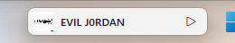
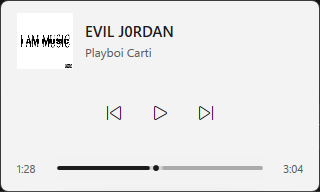
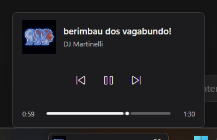
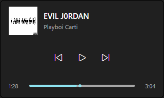

# TaskBarHook

Controle de mídia que mora na barra de tarefas do Windows 11: uma cápsula compacta encaixada no vão livre da taskbar, com painel completo de reprodução e seek.




Sem Top Mode, volume, playlists, login ou seletor manual de player — só o essencial, onde seus olhos já estão.

## Recursos

- **Compacto dentro da faixa da taskbar** (~200×32 DIP), com capa, título e play/pause; encolhe para o modo mínimo (~72×32) ou some para a bandeja quando não há espaço.
- **Painel de reprodução** com capa, artista, anterior/play/próxima, barra de posição e um atalho **Próximas** que abre a fila num painel flutuante (consulta, sem reordenar).
- **Teclado**: setas ±5 s, Home/End, Tab com foco visível; Espaço fora da barra alterna play/pause.
- **Temas**: acompanha o modo claro/escuro do sistema ao vivo, usa a cor de destaque com um anel de foco ≥ 3:1 e respeita alto contraste e animações reduzidas.
- **Boa convivência**: some em tela cheia exclusiva, diante do Iniciar, pesquisa e prévias — e volta sozinho quando liberado.
- **Sem privilégios de administrador**, sem injeção no Explorer, sem `SetParent`, sem mover controles da barra.




## Requisitos

- Windows 11 x64
- Barra de tarefas na parte inferior e visível
- Apenas o monitor principal
- Spotify desktop como player principal de validação (qualquer player SMTC funciona)

Barra em outro lado, ocultação automática ou substitutos da taskbar ficam fora do recorte: o compacto some e o acesso continua pelo ícone da área de notificação. O aplicativo não altera configurações do Windows.

## Instalação

Baixe o `TaskBarHook-win-x64.zip` da [página de releases](../../releases) mais recente, extraia e execute `TaskBarHook.exe`. Pasta autocontida, sem instalador.

Para compilar do código-fonte (SDK do .NET 10):

```powershell
dotnet publish src/TaskBarHook/TaskBarHook.csproj -c Release -r win-x64 --self-contained true -o artifacts/win-x64
.\artifacts\win-x64\TaskBarHook.exe
```

Para a fila do Spotify (opcional): crie um app em [developer.spotify.com](https://developer.spotify.com/dashboard), defina o redirect `http://127.0.0.1:47823/callback` e a variável de ambiente `TASKBARHOOK_SPOTIFY_CLIENT_ID`. Escopos: `user-read-currently-playing` e `user-read-playback-state`. O executável não contém client secret; os tokens ficam protegidos em `%LOCALAPPDATA%\TaskBarHook\secrets`. Sem essa credencial a fila informa o que falta em vez de inventar faixas.

## Uso

- **Compacto**: capa, título truncado, play/pause. Clique na superfície abre ou fecha o painel.
- **Painel**: clique na barra escolhe um ponto; arrastar o indicador escolhe com precisão e soltar envia um único pedido. Durante o arraste o tempo acompanha o ponteiro.
- **Próximas**: no painel expandido, passa o ponteiro (ou clique/teclado) para ver a fila ao lado, sem trocar de ecrã. Esc fecha a lista primeiro.
- **Sem suporte a seek** na sessão, a barra fica só informativa, sem indicador de comando.
- **Esc** cancela a prévia; se a fila estiver aberta, fecha só a lista; senão fecha o painel. Clique fora e Alt+Tab também fecham.
- **Bandeja**: Abrir painel, Ocultar/Mostrar cápsula, Sair.

Argumentos úteis para diagnóstico:

- `--simulate` — fonte de mídia simulada, inclusive uma fila de demonstração (nunca é o padrão; `TASKBARHOOK_SIMULATE=1` também ativa)
- `--probe` — lê sessões SMTC e encerra
- `--inspect-taskbar` — lê geometria/ocupação da barra e encerra
- `--seek-selftest` — seek SMTC de ida e volta sem abrir a UI

Logs: `%LOCALAPPDATA%\TaskBarHook\logs\app.log`

## Como funciona

- **Mídia**: integração via SMTC (`SystemMediaTransportControls`) para faixa atual e comandos. A fila usa o endpoint oficial `GET /v1/me/player/queue` (PKCE, sem client secret), nunca playlist, histórico ou recomendações.
- **Posicionamento**: a ocupação da barra é lida com `SHAppBarMessage`, filhos de `Shell_TrayWnd` e UI Automation só para geometria, fora da thread da interface. Leitura incompleta nunca vira vão livre.
- **Seek**: prévia local, posição real e pedido pendente são estados separados, com reconciliação e cancelamento por troca de faixa/sessão.
- **Aparência**: paleta semântica resolvida do tema do sistema em tempo real, sem recriar janelas.

Detalhes de cada decisão e da validação em [docs/DECISIONS.md](docs/DECISIONS.md).

## Desenvolvimento

```powershell
dotnet test TaskBarHook.slnx   # suíte completa (testes de unidade + WPF)
```

## Limitações

- Sem inicialização automática com o Windows.
- Nem toda sessão SMTC permite seek, tem duração conhecida ou libera toda a faixa.
- Tela cheia (F11, vídeo, jogo sem borda) oculta compacto e painel. Maximizado com a barra visível não é tela cheia.

## Licença

MIT — veja [LICENSE](LICENSE).
